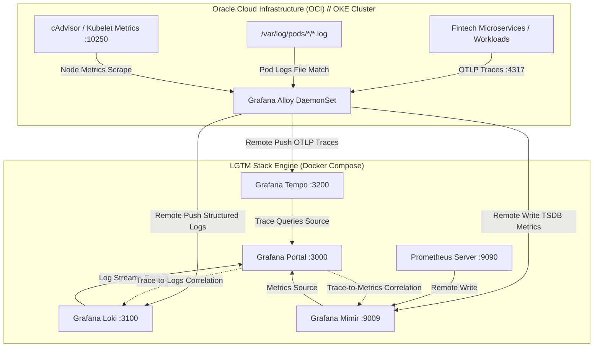

<div align="center">

  <h1>observability-lgtm-stack</h1>
  <p><strong>Enterprise LGTM Observability Stack (Grafana, Mimir, Tempo, Loki, Prometheus, Alloy) & OKE Telemetry</strong></p>

  <p>
    
    
    
    
    
    
    
  </p>

</div>

---

### Overview

`observability-lgtm-stack` provides an end-to-end, enterprise-grade telemetry platform unifying **Logs, Metrics, and Distributed Traces** (the three pillars of observability).

Designed to bridge local control-plane inspection with cloud-native Kubernetes workloads on **Oracle Container Engine for Kubernetes (OKE)**, this repository delivers:
1. **Unified Docker Compose Control Plane:** Pre-wired instances of Grafana, Prometheus, Mimir, Loki, Tempo, and Grafana Alloy.
2. **Native Cross-Correlation (The Holy Grail of SRE):**
   - **Trace-to-Logs:** Inspect a span in Tempo and jump directly to the exact application logs in Loki matching the `trace_id`.
   - **Trace-to-Metrics:** Jump from high-latency traces directly into RED service graphs in Mimir/Prometheus.
3. **OKE DaemonSet Telemetry:** Production Kubernetes manifests deploying **Grafana Alloy** as a DaemonSet across OKE worker nodes to collect container logs from `/var/log/pods`, cAdvisor node metrics, and OTLP traces.
4. **Automated Dashboard Bootstrapping:** Python automation script utilizing Grafana's REST API to immediately provision production dashboards upon startup.

---

### End-to-End Telemetry Architecture



---

### Service Matrix & Port Allocations

| Service | Container Name | Host Port | Protocol / Purpose |
| :--- | :--- | :--- | :--- |
| **Grafana** | `lgtm-grafana` | `3000` | Web UI & Visualization Dashboard |
| **Prometheus** | `lgtm-prometheus` | `9090` | Real-time metric scraping & remote_write |
| **Mimir** | `lgtm-mimir` | `9009` | High-scale long-term Prometheus storage |
| **Loki** | `lgtm-loki` | `3100` | Microsecond LogQL log aggregation |
| **Tempo** | `lgtm-tempo` | `3200` | TraceQL query interface |
| **Tempo OTLP (gRPC)** | `lgtm-tempo` | `4317` | OpenTelemetry gRPC trace receiver |
| **Tempo OTLP (HTTP)** | `lgtm-tempo` | `4318` | OpenTelemetry HTTP trace receiver |
| **Grafana Alloy** | `lgtm-alloy` | `12345` | Alloy Agent pipeline health & UI |

---

### Quickstart: Local Control-Plane (Docker)

#### 1. Launch the LGTM Stack

```bash
# Clone the repository
git clone https://github.com/NeoScraids/observability-lgtm-stack.git
cd observability-lgtm-stack

# Launch all unified containers
docker compose up -d
```

Verify that all services are healthy:

```bash
docker compose ps
```

#### 2. Bootstrap Production Dashboards

Execute the included Python automation script to verify Grafana readiness and import pre-configured dashboards:

```bash
python scripts/bootstrap_dashboards.py
```

#### 3. Access Grafana

Navigate to [http://localhost:3000](http://localhost:3000) in your web browser:
- **Default Username:** `admin`
- **Default Password:** `admin`
- **Pre-configured Data Sources:** `Mimir` (Default), `Loki`, `Tempo`, `Prometheus`.

---

### Deploying Telemetry Agent to Oracle Kubernetes Engine (OKE)

To extract live node logs, container traces, and cluster metrics from an active OKE cluster into this observability stack:

#### 1. Configure Target Endpoints
Edit `k8s-oke/alloy-daemonset.yaml` with your accessible host endpoints:

```yaml
env:
  - name: TEMPO_ENDPOINT
    value: "tempo.your-observability-domain.com:4317"
  - name: LOKI_ENDPOINT
    value: "http://loki.your-observability-domain.com:3100/loki/api/v1/push"
  - name: MIMIR_ENDPOINT
    value: "http://mimir.your-observability-domain.com:9009/api/v1/push"
```

#### 2. Apply Manifests with `kubectl`

```bash
# Create dedicated namespace and RBAC permissions
kubectl apply -f k8s-oke/rbac.yaml

# Deploy the Alloy Agent ConfigMap (River configuration)
kubectl apply -f k8s-oke/configmap-alloy.yaml

# Deploy Alloy DaemonSet across all worker nodes
kubectl apply -f k8s-oke/alloy-daemonset.yaml
```

Verify agent rollout across all cluster nodes:

```bash
kubectl get pods -n observability -o wide
```

---

### Dashboards Included

1. **`Cluster & Node Infrastructure Overview` (`cluster-overview`):**
   - Live CPU Utilization (%) per node instance
   - RAM memory saturation and available memory tracking
   - Network I/O throughput (Rx/Tx) grouped by Kubernetes Namespace
2. **`RED Metrics & Distributed Tracing Correlator` (`red-metrics-traces`):**
   - Rate (Requests per second) calculated from span metrics
   - Errors (% Failure rate over total invocations)
   - Duration (p95 latency histograms)
   - Embedded Loki log streams with click-to-trace deep linking

---

### License

Distributed under the MIT License. Developed and maintained by [Brandon Mendieta](https://github.com/NeoScraids).
