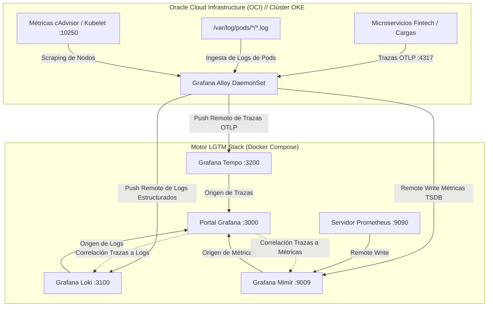

<div align="center">

  <h1>observability-lgtm-stack</h1>
  <p><strong>Stack de Observabilidad Empresarial LGTM (Grafana, Mimir, Tempo, Loki, Prometheus, Alloy) y Telemetría para OKE</strong></p>

  <p>
    
    
    
    
    
    
    
  </p>

</div>

---

### Descripción General

`observability-lgtm-stack` es una plataforma integral de observabilidad empresarial que unifica los **tres pilares de la observabilidad moderna (Métricas, Logs y Trazas Distribuidas)** con correlación cruzada nativa.

Diseñado para conectar el plano de control local con cargas de trabajo de nube en clústeres **Oracle Container Engine for Kubernetes (OKE)**, este repositorio proporciona:
1. **Plano de Control Unificado en Docker Compose:** Instancias preconfiguradas e interconectadas de Grafana, Prometheus, Mimir, Loki, Tempo y Grafana Alloy.
2. **Correlación Cruzada Nativa (Estándar SRE):**
   - **Trazas a Logs:** Al inspeccionar una traza en Tempo, puedes saltar en un clic a las líneas de log exactas en Loki asociadas al `trace_id`.
   - **Trazas a Métricas:** Desde trazas lentas se accede directamente a gráficas de latencia y tasa de errores en Prometheus/Mimir.
3. **DaemonSet de Telemetría para OKE:** Manifiestos listos para producción que despliegan **Grafana Alloy** en cada worker node de OKE para recolectar logs de `/var/log/pods`, métricas de cAdvisor y trazas OTLP de aplicaciones.
4. **Inicialización Automatizada de Dashboards:** Script en Python que utiliza la API REST de Grafana para aprovisionar automáticamente tableros de producción al arrancar.

---

### Arquitectura de Telemetría de Extremo a Extremo



---

### Matriz de Servicios y Asignación de Puertos

| Servicio | Contenedor | Puerto Host | Protocolo / Propósito |
| :--- | :--- | :--- | :--- |
| **Grafana** | `lgtm-grafana` | `3000` | Interfaz Web y Dashboards de Visualización |
| **Prometheus** | `lgtm-prometheus` | `9090` | Scraping de métricas en tiempo real y remote_write |
| **Mimir** | `lgtm-mimir` | `9009` | Almacenamiento distribuido a largo plazo para Prometheus |
| **Loki** | `lgtm-loki` | `3100` | Agregación y consultas de logs mediante LogQL |
| **Tempo** | `lgtm-tempo` | `3200` | Consultas TraceQL y motor de trazas |
| **Tempo OTLP (gRPC)** | `lgtm-tempo` | `4317` | Receptor gRPC de trazas OpenTelemetry |
| **Tempo OTLP (HTTP)** | `lgtm-tempo` | `4318` | Receptor HTTP de trazas OpenTelemetry |
| **Grafana Alloy** | `lgtm-alloy` | `12345` | Interfaz de estado del pipeline Alloy y telemetría |

---

### Inicio Rápido: Plano Local con Docker

#### 1. Iniciar el Stack LGTM

```bash
# Clonar el repositorio
git clone https://github.com/NeoScraids/observability-lgtm-stack.git
cd observability-lgtm-stack

# Iniciar todos los contenedores en segundo plano
docker compose up -d
```

Verifica que todos los servicios estén en ejecución:

```bash
docker compose ps
```

#### 2. Inicializar Dashboards Automáticamente

Ejecuta el script en Python incluido para verificar la disponibilidad de Grafana e importar los tableros preconfigurados:

```bash
python scripts/bootstrap_dashboards.py
```

#### 3. Acceder a Grafana

Abre tu navegador en [http://localhost:3000](http://localhost:3000):
- **Usuario por defecto:** `admin`
- **Contraseña por defecto:** `admin`
- **Data Sources precargados:** `Mimir` (Predeterminado), `Loki`, `Tempo`, `Prometheus`.

---

### Despliegue del Agente de Telemetría en Oracle Kubernetes Engine (OKE)

Para capturar logs de pods, trazas de microservicios y métricas de nodos de un clúster OKE activo:

#### 1. Configurar los Endpoints de Destino
Edita `k8s-oke/alloy-daemonset.yaml` con las direcciones accesibles de tu stack:

```yaml
env:
  - name: TEMPO_ENDPOINT
    value: "tempo.tu-dominio-observabilidad.com:4317"
  - name: LOKI_ENDPOINT
    value: "http://loki.tu-dominio-observabilidad.com:3100/loki/api/v1/push"
  - name: MIMIR_ENDPOINT
    value: "http://mimir.tu-dominio-observabilidad.com:9009/api/v1/push"
```

#### 2. Aplicar Manifiestos con `kubectl`

```bash
# Crear el namespace dedicado y permisos RBAC
kubectl apply -f k8s-oke/rbac.yaml

# Desplegar el ConfigMap del agente Alloy (configuración en sintaxis River)
kubectl apply -f k8s-oke/configmap-alloy.yaml

# Desplegar el DaemonSet de Alloy en todos los worker nodes de OKE
kubectl apply -f k8s-oke/alloy-daemonset.yaml
```

Verifica el despliegue del agente en todos los nodos:

```bash
kubectl get pods -n observability -o wide
```

---

### Tableros (Dashboards) Incluidos

1. **`Cluster & Node Infrastructure Overview` (`cluster-overview`):**
   - Utilización de CPU en tiempo real (%) por instancia de nodo
   - Saturación de memoria RAM y seguimiento de memoria disponible
   - Rendimiento de red (Rx/Tx) agrupado por namespace de Kubernetes
2. **`RED Metrics & Distributed Tracing Correlator` (`red-metrics-traces`):**
   - Tasa de peticiones por segundo (RPS) calculada a partir de span metrics
   - Tasa de errores (% de fallos sobre el total de invocaciones)
   - Duración y percentiles de latencia (histogramas p95)
   - Visor de logs en vivo de Loki integrado con enlaces directos a trazas de Tempo

---

### Licencia

Distribuido bajo la Licencia MIT. Desarrollado y mantenido por [Brandon Mendieta](https://github.com/NeoScraids).
